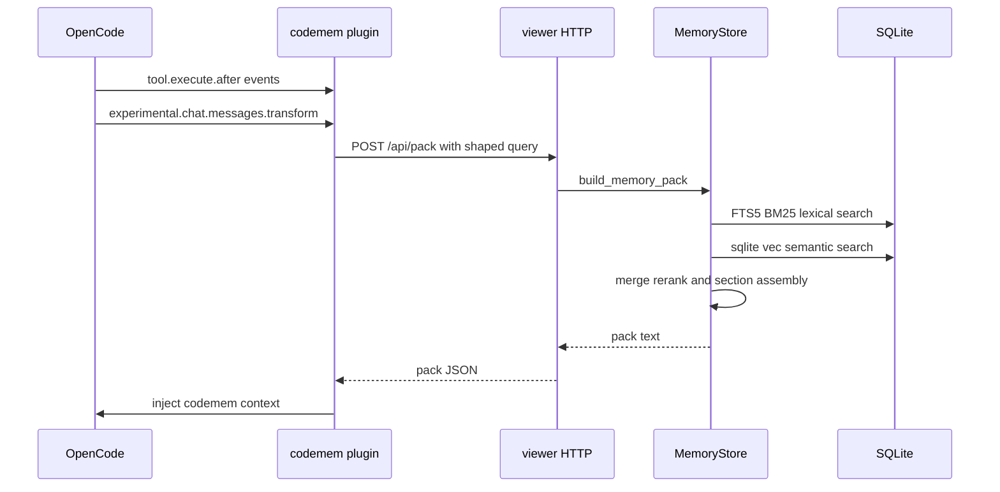

# codemem

[](https://github.com/kunickiaj/codemem/actions/workflows/ci.yml) [](https://codecov.io/gh/kunickiaj/codemem) [](https://github.com/kunickiaj/codemem/releases)

Persistent memory for [OpenCode](https://opencode.ai) and [Claude Code](https://claude.ai/code). codemem captures what you work on across sessions, retrieves relevant context using hybrid search, and injects relevant context automatically in OpenCode.

- **Local-first** — everything lives in SQLite on your machine
- **Hybrid retrieval** — FTS5 BM25 lexical search + sqlite-vec semantic search, merged and re-ranked
- **Automatic injection** — the OpenCode plugin injects context into every prompt, no manual steps
- **Claude Code plugin support** — install from the codemem marketplace source
- **Built-in viewer** — browse memories, sessions, and observer output in a local web UI
- **Peer-to-peer sync** — replicate memories across machines without a central service

> **EliaAI fork (vakandi/codemem)** — based on `kunickiaj/codemem` with production fixes for the EliaAI subworker fleet (verified Aug 2026):
> - **Strict scoped project isolation** — `EliaAI` matches `EliaAI/*` children, `EliaAI/gilfoyle` is exact-only (no `gilfoyle` basename leak from `nayo-app-fastapi/gilfoyle`). Fixes cross-repo injection where `EliaAI` was pulling `nayo` memories.
> - **SQL LIKE safety** — `ESCAPE '\'` for `%`/`_` in project names.
> - **EliaAI subworker integration** — `subworkers/server` runs fully dockerized (`elia-subworker-srv` 5656+5655, `TZ=Africa/Casablanca`, `opencode-data` volume for persistence, manual `POST /sessions/{name}/{id}/continue` for TopBar).

<picture>
  <source media="(prefers-color-scheme: dark)" srcset="docs/images/codemem-dark.png">
  
</picture>

## Quick start

**Prerequisites:** Node.js 24+ and npm (or pnpm)

### OpenCode

1. Install the OpenCode plugin and MCP config:

```text
npx -y codemem setup --opencode-only
```

2. Restart OpenCode.

The OpenCode plugin manages backend execution automatically — no separate global install is required.

3. Verify:

```text
# Works on fresh installs (no global codemem needed)
npx -y codemem stats
npx -y codemem db raw-events-status
```

That's it. The plugin captures activity, builds memories, and injects context from here on.

If you want `codemem` available directly on your `PATH` for manual commands, install the CLI globally:

```text
npm install -g codemem
```

OpenCode plugin and CLI are now split intentionally:

- `@codemem/opencode-plugin` — OpenCode plugin package
- `codemem` — CLI and MCP commands

### Claude Code (marketplace install)

1. Install codemem's Claude MCP config:

```text
npx -y codemem setup --claude-only
```

2. In [Claude Code](https://claude.ai/code), add the codemem marketplace source and install the plugin:

```text
/plugin marketplace add kunickiaj/codemem
/plugin install codemem
```

The Claude plugin starts MCP with the TS CLI (`codemem mcp`).

Claude and Codex plugins normalize native hooks at the plugin edge and send the resulting envelope to the canonical `POST /api/raw-events` endpoint. New ingestion requests include the intended database path and runtime identity target; Viewer rejects a mismatch before writing, and the client uses its existing identity-correct command fallback. On a retryable Viewer failure, Codex persists that exact envelope before attempting command fallbacks and removes the spool only after a fallback succeeds; Claude uses the command fallbacks without a file spool. Claude `SessionEnd` asks Viewer to finish boundary extraction best-effort inside the host's 1.5-second default exit budget, reserving command-fallback time after preprocessing and across both HTTP attempts. `Stop` flushing remains opt-in and uses a 130-second host timeout for its 125-second internal extraction budget. Transcript fallback reads at most the final 16 MiB: it preserves the first record when the tail starts immediately after a newline, but discards the first fragment when the tail starts in the middle of a record. The checked-in dependency-free normalizers are generated from the TypeScript implementations in `packages/core/src/claude-hooks.ts` and `packages/core/src/codex-hooks.ts`. Named Viewer hook routes remain compatibility aliases/callers for older packaged and plugin-free CLI paths; requests that omit targeting fields remain accepted for 0.41 compatibility.

Claude and Codex `UserPromptSubmit` hooks are dependency-free direct Viewer clients. They perform a
payload-free compatible-profile check, retrieve an identity-gated `POST /api/pack` response, return
host-compatible `additionalContext`, and record delivery best-effort (capped at 500 ms). Healthy retrieval
starts no `codemem` or `npx` child. Retryable Viewer/version/profile failures—including structured
request errors before a compatible handshake—use one local compatibility chain. Validated request errors
after compatibility is established, plus policy, authorization, and compatible-profile contract failures,
fail closed.
Prompt and event HTTP reject non-loopback Viewer hosts without fetching them. Codex reserves a total
4.5-second prompt-output budget within its 5-second host timeout.

### Codex (early beta)

Codex support is **early beta** — functional and dogfooded, but not yet promoted to a stable support tier. It installs through Codex's own plugin marketplace:

1. Add the codemem marketplace and install the plugin:

```text
codex plugin marketplace add https://github.com/kunickiaj/codemem.git
codex plugin add codemem@codemem
```

2. Restart Codex.

The Codex plugin bundles its MCP config (`codemem mcp`), hooks, and generated normalizer. Healthy hook ingestion uses Viewer HTTP directly and starts no `codemem` or `npx` child; those commands are fallback-only. A global install remains optional and reduces fallback latency. Validated targets are Codex CLI 0.135+ and current Desktop builds.

**API-key Codex Desktop (marketplace unavailable):** When plugin installation is greyed out (non-subscription / API-key Desktop), configure codemem without the plugin surface:

```text
npx -y codemem setup --codex-only
```

This merges `[mcp_servers.codemem]` into `~/.codex/config.toml` and writes `~/.codex/hooks.json` (SessionStart, UserPromptSubmit, PostToolUse, Stop) — backing up existing files and preserving unrelated entries. Restart Codex and approve the one-time prompt to trust the codemem hooks. MCP recall works immediately. If `codemem` is on your `PATH` the hooks call it directly; otherwise they fall back to `npx -y codemem`. Honors `CODEX_HOME`; re-runnable (use `--force` to refresh).

Codex hook ingestion shares the same raw-event pipeline as Claude and OpenCode through normalized `POST /api/raw-events`. After a retryable HTTP failure it writes the exact envelope to `~/.codemem/codex-raw-event-spool`, attempts the `codemem enqueue-raw-event` command fallbacks, and removes the spooled envelope only after success. That spool is separate from the legacy native-hook spool. `UserPromptSubmit` runs capture ingest in the background and injects memory context via `additionalContext`; disable injection with `CODEMEM_INJECT_CONTEXT=0`. See [docs/plugin-reference.md](docs/plugin-reference.md) for details and troubleshooting.

> Migrating from `opencode-mem`? See [docs/rename-migration.md](docs/rename-migration.md).

## How it works

Adapters hook into runtime event systems (OpenCode plugin and Claude hooks). They capture tool calls and conversation messages, flush them through an observer pipeline that produces typed memories, and surface retrieval context for future prompts.



**Retrieval** combines two strategies: keyword search via SQLite FTS5 with BM25 scoring and semantic similarity via sqlite-vec embeddings. In the pack-building path, results from both are merged, exactly deduplicated, and re-ranked using recency and memory-kind boosts. Near-related memories stay fully rendered by default; use compact rendering or `CODEMEM_PACK_COMPRESSION=ids` only when you intentionally want ID-based expansion via `memory_get_observations`.

**Injection** happens automatically. The plugin builds a query from the current session context (first prompt, latest prompt, project, recently modified files), asks the long-lived local viewer to build the pack, and appends the result to the latest user message via `experimental.chat.messages.transform`. Before sending prompt-derived POST data, it performs a payload-free viewer/profile handshake and rejects redirects. Retryable viewer transport, version, database-target, effective identity/config-target, compression-setting, embedding-setting mismatch, or pre-handshake structured request failures fall back to the existing CLI path; structured request errors become terminal only after compatibility is established. Prior injected message blocks are replayed byte-for-byte on later turns so provider prompt caches can keep the stable prefix. Set `CODEMEM_INJECT_SURFACE=system` to use the legacy system-prompt surface. OpenCode raw-event capture streams through the viewer and falls back to direct CLI enqueue; explicit SQLite busy/locked results and command timeouts receive one idempotent retry with the same event ID, while terminal failures are reported and dropped instead of requeued. Each retrieval and current-request cache reuse is recorded through the viewer-backed local evidence ledger with bounded memory identities, machine-readable reason codes, delivery status, and safe repository-relative working-set paths; retryable ledger transport failures retain the CLI fallback. Repository-contained absolute tool paths are converted to repository-relative `/` paths before retrieval; outside-repository, traversing, blank, and overlong paths are omitted. Prompts, pack text, memory content, and absolute paths are not copied into the ledger, historical message reconstruction creates no new attempts, and recording failures never block injection. After a plugin restart, usable context also remains fail-open when fresh ledger-identity repair fails; fallback bytes are injected without attributing delivery to either the conflicted or failed attempt.

The profile response advertises a closed compatibility range from
`min_supported_protocol_version` through `protocol_version`. OpenCode accepts
overlapping ranges, including legacy single-version profiles. Database/runtime
identity mismatch falls back locally once without reading or retrying that Viewer.
Validated request, policy, authorization, and `viewer_contract_unsupported`
failures after a compatible handshake fail closed without a CLI child.

**Memories** are typed — `bugfix`, `feature`, `refactor`, `change`, `discovery`, `decision`, `exploration` — with structured fields like `facts`, `concepts`, `files_read`, and `files_modified` that improve retrieval relevance. Low-signal events are filtered at multiple layers before persistence.

For architecture details, see [docs/architecture.md](docs/architecture.md).

## CLI

| Group | Command | Description |
|-------|---------|-------------|
| **Core** | `codemem status` | Local operational roll-up (`--json` supported) |
| | `codemem stats` | Database statistics |
| | `codemem stats --attribution` | Bounded local retrieval-attribution diagnostics (`--json` supported) |
| | `codemem recent` | Recent memories |
| | `codemem search <query>` | Search memories |
| | `codemem pack <context>` | Build a context-aware memory pack |
| | `codemem pack trace <context>` | Inspect retrieval and pack assembly for a manual query |
| | `codemem distill` | Mine recurring memories into reviewable context candidates |
| | `codemem embed` | Backfill semantic embeddings |
| **Memory** | `codemem memory show <id>` | Print a memory item as JSON |
| | `codemem memory forget <id>` | Deactivate a memory item |
| | `codemem memory remember` | Manually add a memory |
| | `codemem memory inject <context>` | Raw pack text for prompt injection |
| | `codemem memory export <output>` | Export memories by project |
| | `codemem memory import <file>` | Import memories (idempotent) |
| **Viewer** | `codemem serve [start\|stop\|restart]` | Launch / manage the web viewer |
| **Sync** | `codemem sync enable\|disable` | Enable or disable peer-to-peer sync |
| | `codemem sync status` | Device info and peer health |
| | `codemem sync pair` | Advanced/legacy device pairing |
| | `codemem sync once` | Run one immediate sync pass |
| | `codemem sync doctor` | Diagnose sync configuration issues |
| | `codemem sync bootstrap` | Bootstrap sync from a peer snapshot |
| **Updates** | `codemem update check` | Check the npm registry for a newer stable release (`--json` and `--refresh` supported) |
| **Coordinator** | `codemem coordinator` | Self-hosted coordinator admin (groups, devices, invites) |
| **Database** | `codemem db prune-memories` | Deactivate low-signal memories (`--dry-run` to preview) |
| | `codemem db prune-observations` | Deactivate low-signal observations |
| | `codemem db backfill-tags` | Populate missing `tags_text` values |
| | `codemem db raw-events-status` | Show raw-event queue status |
| **Config** | `codemem config` | View or update configuration |
| | `codemem setup` | Interactive first-run setup |
| **Plumbing** | `codemem mcp` | MCP stdio server; best-effort starts the local viewer unless `CODEMEM_VIEWER=0` or `CODEMEM_VIEWER_AUTO=0` is set |
| | `codemem mcp http` | Local Streamable HTTP MCP server (`POST /mcp`, loopback-only by default) |

Run `codemem --help` for the human-facing command list. Adapter plumbing commands (`claude-hook-*`, `codex-hook-*`, `enqueue-raw-event`, and `prompt-pack-ledger`) remain executable for packaged-plugin and stale-client compatibility but are hidden from help and shell completion. `show`, `forget`, and `remember` still work as hidden top-level aliases. `export-memories` and `import-memories` remain visible but are deprecated — they warn on stderr and will be hidden from help and completion in a future release; use `codemem memory export` / `codemem memory import`.

Use `codemem status` to answer whether the local database, viewer, sync, maintenance,
semantic index, raw-event ingestion, and observer need attention. It is observational:
it does not create a missing database, repair state, inspect credentials, or contact
peers, coordinators, registries, or non-loopback hosts. Use `codemem status --json`
for the stable machine-readable report. `codemem stats` remains the inventory and
usage command; use `sync status`/`sync doctor`, `maintenance status`, and
`db raw-events-status` for subsystem detail.

`codemem update check` is read-only: it reports the latest validated stable release and
installation-specific guidance. Results are cached for six hours;
pass `--refresh` to force a registry request or `--json` for one stable status object.
The Viewer Health page reads the same status from `/api/update-status`. The OpenCode plugin
checks it after startup and shows at most one best-effort notification for each newly discovered
release. `notify` is the default. Explicit `auto` policy may run `codemem update install` only for
a fresh, validated npm release observed for at least 24 hours and an installation whose npm origin
can be proven. Pinned, prerelease, downgrade, repository-development, stale, Docker, and unknown
installs refuse execution. Set `CODEMEM_BACKEND_UPDATE_POLICY=off` to disable release checks.
Docker guidance is always rebuild-and-restart guidance, never an in-container update.

Pack rendering defaults to self-contained context. For token-constrained experiments, `codemem pack <context> --compact` renders an index plus top details. Near-related compression is controlled by `--compression-mode off|compact|ids` (or `CODEMEM_PACK_COMPRESSION`); MCP `memory_pack` exposes the same setting as `compression_mode`. Use `ids` only when the agent can follow up with `memory_get_observations`.

### Distill recurring lessons

`codemem distill` finds repeated discoveries and decisions that may be worth promoting into project or user context.

```text
codemem distill --explain               # ranked candidates + evidence
codemem distill --all-projects --json   # machine-readable
codemem distill --no-judge              # skip the observer-model worthiness judgment
codemem distill --draft                 # draft an AGENTS.md rule for the top candidate and show a diff
codemem distill --draft --apply         # write it after confirmation
```

Candidate mining is deterministic, and by default an observer-model worthiness pass then drops clusters of recurring routine activity (release/CI status, review passes with no findings, context lookups) that recurrence scoring cannot distinguish from real lessons. Without a configured observer model the command falls back to unjudged output with a warning; `--no-judge` opts out entirely. `--draft` uses your configured observer model to turn the top candidate into a single `AGENTS.md` rule and renders a unified diff; nothing is written. `--apply` writes that rule into a codemem-managed `## Distilled lessons` block (delimited by `<!-- codemem:distilled:begin/end -->` markers, so all distilled edits stay in one place) after prompting for confirmation.

## MCP tools

To give the LLM direct access to memory tools (search, timeline, pack, distill candidates, remember, forget):

```text
codemem setup --opencode-only
```

This updates your OpenCode config to install the plugin and register the MCP server. Restart OpenCode to activate.

The standalone `codemem-mcp-ts` binary runs the same stdio server used by `codemem mcp`. Viewer autostart is on by default for both invocation paths; set `CODEMEM_VIEWER=0` or `CODEMEM_VIEWER_AUTO=0` to disable. MCP autostart and the `serve start`/`stop`/`restart` lifecycle identify a running viewer through `GET /api/health` (service discriminator `codemem-viewer`), with one bounded `GET /api/stats` compatibility probe when an older viewer returns `404`.

For local HTTP transport testing, run `codemem mcp http`. It listens on `127.0.0.1:38889` by default and exposes Streamable HTTP at `POST /mcp`; use `--host`, `--port`, and `--db-path` to override those values. OAuth discovery metadata and Dynamic Client Registration are available at `/.well-known/oauth-authorization-server`, `/.well-known/oauth-protected-resource/mcp`, and `/register`; set `--public-url` or `CODEMEM_MCP_HTTP_PUBLIC_URL` to the externally reachable `/mcp` URL so advertised endpoints use the public origin. `/authorize` redirects through a configured upstream OIDC provider before issuing public-client authorization codes, `/token` supports PKCE S256 exchange, and `/oauth/revoke` revokes access tokens. When a public URL or OIDC configuration is present, `POST /mcp` requires a valid bearer token; local-only HTTP mode remains unauthenticated for development and still applies loopback Host/Origin checks. Non-loopback binds are rejected unless you explicitly pass `--unsafe-public` or set `CODEMEM_MCP_HTTP_UNSAFE_PUBLIC=1`.

## Configuration

Config resolution precedence for runtime commands is:

1. explicit `CODEMEM_CONFIG`
2. workspace-scoped config derived from `CODEMEM_RUNTIME_ROOT` or `CODEMEM_WORKSPACE_ID`
3. legacy global config at `~/.config/codemem/config.json{c}`

Environment variables still override file values once a config file has been selected.

Common overrides:

| Variable | Purpose |
|----------|---------|
| `CODEMEM_DB` | SQLite database path |
| `CODEMEM_INJECT_CONTEXT` | `0` to disable automatic context injection |
| `CODEMEM_INJECT_SURFACE` | `message` (default) to inject near the latest OpenCode user message; `system` for the legacy OpenCode system-prompt surface |
| `CODEMEM_VIEWER_HOST`, `CODEMEM_VIEWER_PORT` | Host/port the plugin-managed viewer should start, probe, and restart |
| `CODEMEM_VIEWER_AUTO` | `0` to disable auto-starting the viewer |
| `CODEMEM_MCP_HTTP_HOST`, `CODEMEM_MCP_HTTP_PORT` | Host/port for `codemem mcp http` |
| `CODEMEM_MCP_HTTP_PUBLIC_URL` | Public `/mcp` URL advertised in MCP OAuth metadata |
| `CODEMEM_MCP_OIDC_ISSUER_URL`, `CODEMEM_MCP_OIDC_CLIENT_ID`, `CODEMEM_MCP_OIDC_CLIENT_SECRET` | Upstream OIDC provider used before MCP OAuth code issuance |
| `CODEMEM_MCP_OAUTH_ALLOWED_SUBJECT`, `CODEMEM_MCP_OAUTH_ALLOWED_EMAIL` | Single-user allowlist for upstream OIDC identity; at least one is required when OIDC is configured |
| `CODEMEM_MCP_HTTP_UNSAFE_PUBLIC` | `1`, `true`, or `yes` to allow non-loopback MCP HTTP binds |

Viewer note:

- The plugin manages one explicit viewer target per runtime. If you run multiple viewers, give each one its own DB/runtime folder instead of sharing `viewer.pid` state next to the same SQLite file.
- The OpenCode plugin monitors viewer liveness through `GET /api/health`. When an older viewer returns `404`, it makes one compatibility probe to the legacy raw-event status endpoint; raw-event ingest preflight remains separate and is bounded by a 5-second timeout.

The viewer includes a grouped Settings modal (`Connection`, `Processing`, `Device Sync`) with shell-agnostic labels and an advanced-controls toggle for technical fields.
- Settings show effective values (configured or default) and only persist changed fields on save.
- The viewer HTTP service is intended for localhost-only use. It does not currently provide a general-purpose auth/session layer for safe public exposure.

Observer runtime/auth:

- Runtime options: `api_http` and `claude_sidecar`.
- `api_http` defaults to `gpt-5.1-codex-mini` (OpenAI path) unless you set `observer_model`.
- Anthropic direct API calls accept Anthropic model IDs/aliases. codemem maps the common Claude shorthand `claude-4.5-haiku` to Anthropic's direct API alias `claude-haiku-4-5`; you can also set a pinned snapshot like `claude-haiku-4-5-20251001` explicitly.
- `claude_sidecar` defaults to `claude-4.5-haiku`; if the selected `observer_model` is unsupported by Claude CLI, codemem retries once with Claude's CLI default model.
- `claude_sidecar` command is configurable with `claude_command` (`CODEMEM_CLAUDE_COMMAND`) as a JSON argv array.
  - Config file example: `"claude_command": ["wrapper", "claude", "--"]`
  - Env var example: `CODEMEM_CLAUDE_COMMAND='["wrapper","claude","--"]'`
- Auth sources: `auto`, `env`, `file`, `command`, `none`.
- `observer_auth_command` must be a JSON string array (argv), not a space-separated string.
  - Config file example: `"observer_auth_command": ["iap-auth", "--audience", "example"]`
  - Env var example: `CODEMEM_OBSERVER_AUTH_COMMAND='["iap-auth","--audience","example"]'`
- Header templates support `${auth.token}`, `${auth.type}`, and `${auth.source}` (for example `Authorization: Bearer ${auth.token}`).
- Queue cadence is configurable with `raw_events_sweeper_interval_s` (seconds) in Settings/config.

## Export and import

Share project knowledge with teammates or back up memories across machines.

```text
# Export current project
codemem memory export project.json

# Import on another machine (idempotent, safe to re-run)
codemem memory import project.json --remap-project ~/workspace/myproject
```

See `codemem memory export --help` and `codemem memory import --help` for full options. The legacy top-level `export-memories` / `import-memories` forms still work but emit a deprecation warning.

## Sharing and devices

Share selected project memories with a teammate, or use the same Project-first model to understand your own devices. The viewer's normal workflow is **Projects → Sharing → Devices → Health**; open **Sharing → Teams** to manage ongoing Team membership and inherited Project access. Sync internals live under **Advanced**.

### Share projects with a teammate

For ongoing collaboration:

1. Assign exact Projects to a **Team**.
2. Invite people to join it.

Team onboarding links Identities and devices. The invitation does not assign Projects to the Team, but a new member inherits every current and future Project assigned to it. Review the Team's Projects before sending or accepting the invitation. Use **Share exact Projects** to send a separate direct Project invitation to one Identity. Team sharing must already be configured, but accepting the direct invitation does not add the recipient to the Team.

For a direct share, choose **Create an invitation → Share exact Projects**:

1. Choose or enter the teammate's **Identity display name**.
2. Select the exact projects to share and review each existing-memory count.
3. Confirm that existing memories **and future activity** from those projects will share, then send the one expiring invite.
4. The recipient reviews and accepts the invitation, then confirms their Identity and device display names. Codemem establishes trust and Project access, then starts the first sync.

Only the reviewed canonical projects are shared—similarly named or sibling projects are not included. A memory marked **Only me** stays local even when its project is shared. Removing access stops future sharing; memories already copied to another device may remain there.

### Add, disable, or restore devices

When an Identity adds another device, codemem shows the exact Projects it will inherit from direct shares and Team policies. Existing exclusions stay excluded. Review that list before sending the add-device invitation; acceptance links the new device to the same Identity without widening Project access.

Disabling a device's enrollment for one coordinator group revokes future delivery only for that group's Projects. The global identity device stays active in **Devices** and can retain access through other groups. In **Advanced → Team administration**, re-enable that group enrollment; the next owner reconciliation pass then restores only the Projects currently authorized through direct shares and Team policies for that group. An offline device simply waits: it keeps its access and catches up when it reconnects. A separate global identity-device revocation removes the device from the active **Devices** list. Neither action remotely erases copied memories.

### Check devices and health

**Devices** is read-only. Each card shows the device's **Owning Identity**, whether it is available, and the Projects it receives:

- **Direct** — the Project was shared with that Identity.
- **Team** — the Identity receives the Project through a Team policy.
- **Waiting** — acceptance, setup, or delivery is waiting; an offline device resumes on reconnect.
- **Needs attention** — setup reached a terminal failure; use the displayed retry action.

Use **Health** for the current status. Globally revoked identity devices are omitted from the active Devices list. A device disabled only for one coordinator group remains listed; use **Advanced → Team administration** to review or re-enable that group enrollment. Removing access prevents future delivery, but cannot erase a copy already delivered to another device.

### Advanced and compatibility

Manual pairing, actor assignment, Spaces, grants, project mappings, and coordinator administration remain available for same-person devices, existing integrations, and diagnostics. They are not required for normal teammate sharing. Existing `#sync` and `#sync/diagnostics` links remain supported as Advanced compatibility routes. See [the user guide](docs/user-guide.md#advanced-operator-and-compatibility-guidance).

### Advanced and legacy device pairing

Use manual pairing only for a same-person device, an existing integration, or a compatibility workflow:

```text
codemem sync enable        # generate device keys
codemem sync pair          # generate pairing payload
codemem serve start        # start it; use serve stop/restart for lifecycle management
codemem sync once          # run one immediate sync pass
```

Legacy pairing and legacy coordinator invitations do not grant project access by themselves. For advanced access details, compatibility, and recovery, see [the user guide](docs/user-guide.md).

For cross-network setups where peer addresses change frequently or mDNS does not cross VPN/network boundaries, codemem also supports optional coordinator-backed discovery with a self-hosted coordinator. The preferred deployment path is the built-in `codemem coordinator` service; see [docs/coordinator-discovery.md](docs/coordinator-discovery.md).

## Semantic recall

Embeddings are stored in sqlite-vec and written automatically when memories are created. Use `codemem embed` to backfill existing memories. If sqlite-vec cannot load, keyword search still works.

## Alternative install methods

<details>
<summary>Local development, npx, git install</summary>

### Local development

```text
pnpm install
pnpm build
pnpm run codemem --help
```

### Via npx (no install)

```text
npx -y codemem stats
```

### Plugin for development

Start OpenCode inside the codemem repo directory — the plugin auto-loads from `.opencode/plugin/`.

</details>

## Documentation

- [Architecture](docs/architecture.md) — data flow, retrieval, observer pipeline, design tradeoffs
- [Coordinator-backed discovery](docs/coordinator-discovery.md) — self-hosted cross-network peer discovery
- [User guide](docs/user-guide.md) — Projects, Sharing, Devices, Health, and Advanced operations
- [Coordinator deployment](docs/coordinator-deployment.md) — advanced operator deployment and discovery
- [Coordinator E2E runbook](docs/coordinator-e2e-runbook.md) — advanced coordinator validation
- [Plugin reference](docs/plugin-reference.md) — plugin behavior, env vars, stream reliability
- [Migration guide](docs/rename-migration.md) — migrating from `opencode-mem`
- [Contributing](CONTRIBUTING.md) — development setup, tests, linting, releases
